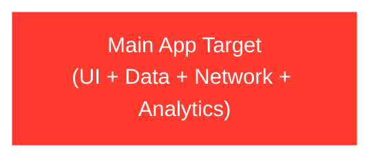
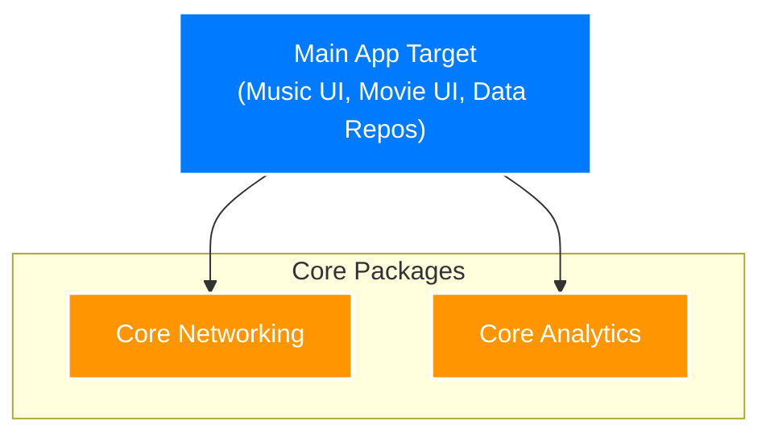
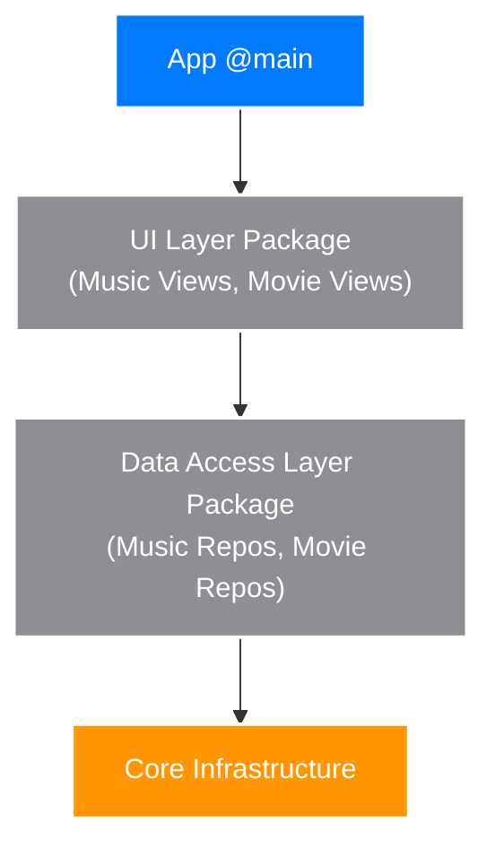
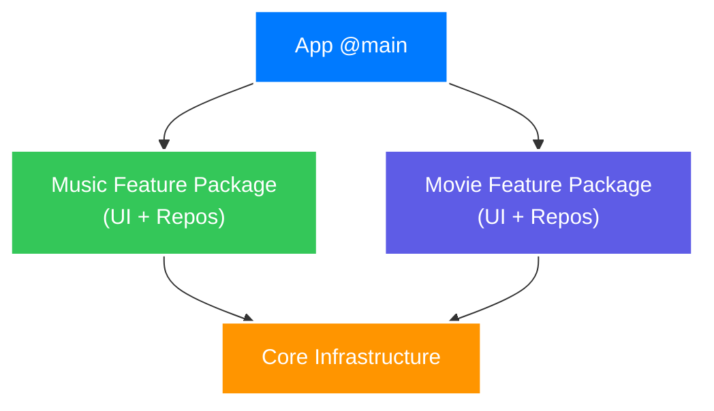
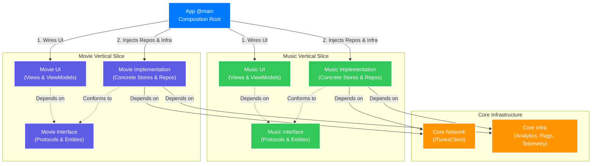

Here is the updated architectural reference. I have reorganized the "Evolutionary Path" section so that each stage has its own distinct `###` header, making room for the requested architectural diagrams. All implementation TODOs have been preserved, and the flow of the document has been tightened for scannability.

---

# iOS Modular Architecture: Vertical Slices & Infrastructure

A reference summary of the modular architecture pattern for a large-scale iOS app, using an **iTunes Search** app (music, movies, audiobooks) as the concrete example.

This architecture solves the scaling challenges of monolithic codebases by combining two powerful concepts:

1. **Vertical Slices (Package by Feature):** Code is grouped by business domain (Music, Movies) rather than technical layer (DataAccess, UI).
2. **Interface/Implementation Split:** Within each vertical slice, abstractions (protocols, entities) are strictly separated from concretions (network calls, third-party SDKs, concrete stores).

Cross-cutting concerns (Network, Analytics, Feature Flags) live in a foundational **Core Infrastructure** layer, ensuring third-party dependencies never leak into domain logic.

---

## The Evolutionary Path to Modularization

Architecture is best understood as a response to friction. This document represents the *final destination*, but teams should arrive here incrementally.

### Stage 1: The Monolithic App

The default starting point. UI, data, and network logic live in a single target.



* **The Breaking Point:** Merge conflicts multiply as the team grows past 3 developers. Every UI tweak triggers a massive recompilation.
* **TODO:** *Flesh out the exact indicators that tell a team it is time to leave the monolith behind.*

### Stage 2: Core Extraction (Bottom-Up Modularization)

Extracting domain-agnostic foundations (Networking, Analytics) into isolated packages.



* **The Breaking Point:** While third-party SDKs are hidden, feature teams are still colliding in the main app target.

### Stage 3: The Horizontal Trap (Layer-Driven Modularization)

The instinctual move to modularize by technical function. Teams group all repositories and models into a massive `DataAccessLayer` package, and all views into a shared `UILayer`.



While it feels like progress, this creates a cautionary tale of distributed coupling. If the Music team needs to add a new song endpoint, they must modify the shared `DataAccessLayer`. This forces a rebuild of the entire data layer for everyone, risking merge conflicts with the Movies team who might be working in the exact same package. A single feature is now fragmented across multiple disconnected codebase layers.

* **The Breaking Point:** High blast radius for domain-specific changes. Feature teams constantly step on each other's toes in shared horizontal modules. "Simple" feature updates require touching 3-4 different packages. Cross-domain data sharing within the massive data layer frequently causes circular dependencies.

### Stage 4: Vertical Slices (Package by Feature)

The pivot to slicing the app by business domain. The horizontal layers are torn down, and instead, code is grouped by feature: a `MusicFeature` package and a `MovieFeature` package. Each vertical slice is completely autonomous, containing its own UI, Models, and Data Access logic tailored specifically for that domain.



* **The Breaking Point:** While team autonomy is solved, testing remains painful. Because views within the vertical slice instantiate their concrete network repositories directly, simulating offline states, swapping mocks for SwiftUI previews, or writing unit tests requires heavy refactoring and overriding. The domain is isolated, but its internal layers are tightly coupled.

### Stage 5: The Abstraction Barrier (The Final Matrix)

Splitting the vertical slices into Interface and Implementation to achieve total decoupling, swappability, and testability. The `MainApp` becomes the single composition root that wires the matrix together.



---

## Why this architecture?

As codebases grow and multiple teams contribute, traditional horizontal layering (grouping all Repositories together, all Views together) creates bottlenecks. Vertical slicing addresses this:

* **Team Autonomy** — The Music team can iterate, refactor, and test the `Music` packages without touching the `Movie` packages or triggering rebuilds for other teams.
* **Encapsulation** — Implementations are hidden behind Interface packages. Domains cannot accidentally couple to each other's concrete types.
* **Swappability** — Any layer (Data Access, Analytics, Feature Flags) can be swapped for fakes at the composition root.
* **Faster Builds** — Xcode only recompiles the specific vertical slice that changed.

---

## The Package Matrix

Instead of a monolithic Data Access layer, the app is structured as independent Swift Packages per domain, resting on shared infrastructure.

| Domain / Layer | Interface Package (Protocols/Entities) | Implementation Package (Concrete Types) | UI Package (Views/VMs) |
| --- | --- | --- | --- |
| **Music** | `Song`, `MusicStore`, `MusicRepository` | `MusicStoreImpl`, `LiveMusicRepo`, `MockMusicRepo` | `MusicView`, `MusicViewModel` |
| **Movies** | `Movie`, `MovieStore`, `MovieRepository` | `MovieStoreImpl`, `LiveMovieRepo`, `MockMovieRepo` | `MovieView`, `MovieViewModel` |
| **Core Infra** | `AnalyticsService`, `FeatureFlagService` | `MixpanelAnalytics`, `LaunchDarklyService` | *N/A* |
| **Core Network** | *N/A* | `iTunesClient` | *N/A* |

*(Note: In smaller apps, UI can live in the Main App module. In larger apps, it is extracted into `MusicUI` to isolate SwiftUI previews and UI tests).*

**TODO:** *Detail how strict Swift concurrency checking applies across these package boundaries, specifically handling `Sendable` types between UI and Implementation modules.*

---

## Core Infrastructure Implementation

Infrastructure defines cross-cutting capabilities without exposing *how* they are achieved.

### 1. Interface (The Abstraction)

Lives in `CoreInfrastructure/Interface`.

```swift
public protocol AnalyticsService: Sendable {
    func trackEvent(_ name: String, properties: [String: String])
}

public protocol FeatureFlagService: Sendable {
    func isEnabled(_ feature: Feature) -> Bool
}

public enum Feature: String, Sendable {
    case newSearchAlgorithm
}

```

### 2. Implementation (The Concretion)

Lives in `CoreInfrastructure/Implementation`. This is the ONLY place that imports third-party SDKs like Firebase, Mixpanel, or Datadog.

```swift
import CoreInfrastructureInterface
import os // Or Mixpanel, Firebase, etc.

public struct OSLogAnalyticsService: AnalyticsService {
    private let logger = Logger(subsystem: "com.app", category: "Analytics")

    public init() {}

    public func trackEvent(_ name: String, properties: [String: String]) {
        logger.info("Event: \(name) | \(properties)")
    }
}

```

---

## A Vertical Slice (Music Domain)

The Music domain owns everything required to fetch, store, and present music, isolated entirely from Movies or Audiobooks.

### 1. Music Interface

Defines the boundary. Contains no implementation details.

```swift
// Music/Interface/Song.swift
public struct Song: Identifiable, Sendable, Decodable { ... }

// Music/Interface/MusicRepository.swift
public protocol MusicRepository: Sendable {
    func search(term: String) async throws -> [Song]
}

// Music/Interface/MusicStore.swift
@MainActor
public protocol MusicStore: AnyObject, Observable {
    var results: [Song] { get }
    var isLoading: Bool { get }
    func search(term: String) async
}

```

### 2. Music Implementation

Contains the concrete classes. It imports `MusicInterface` (to conform to its protocols) and `CoreInfrastructure` (to log errors or check flags).

```swift
import MusicInterface
import CoreInfrastructureInterface

@Observable
@MainActor
public final class MusicStoreImpl: MusicStore {
    public private(set) var results: [Song] = []
    public private(set) var isLoading = false
    
    private let repository: any MusicRepository
    private let analytics: any AnalyticsService

    public init(repository: any MusicRepository, analytics: any AnalyticsService) {
        self.repository = repository
        self.analytics = analytics
    }

    public func search(term: String) async {
        isLoading = true
        analytics.trackEvent("Music_Search", properties: ["term": term])
        
        do {
            results = try await repository.search(term: term)
        } catch {
            // Handle error, optionally log to TelemetryService
        }
        isLoading = false
    }
}

```

### 3. Music UI

Depends ONLY on `MusicInterface` and `CoreInfrastructureInterface`. It never imports `MusicImplementation`.

**TODO:** *Expand on how the `@Observable` macro and the Store pattern naturally enforce unidirectional data flow within the view layer.*

```swift
import SwiftUI
import MusicInterface
import CoreInfrastructureInterface

@MainActor
@Observable
public final class MusicViewModel {
    private let store: any MusicStore
    private let featureFlags: any FeatureFlagService

    public init(store: any MusicStore, featureFlags: any FeatureFlagService) {
        self.store = store
        self.featureFlags = featureFlags
    }
    
    // ... presentation logic ...
}

```

---

## The App Module — Composition Root

The `@main` App is the only place that imports everything. It acts as the "glue", instantiating the concrete infrastructure, concrete repositories, and injecting them into the ViewModels.

**TODO:** *Include a deep dive into cross-module routing. Explain how MVVM-C (Coordinators) can be initialized in the App target to manage navigation flows between completely isolated vertical slices (e.g., navigating from a `MovieView` to a `SoundtrackView` without the domains knowing about each other).*

```swift
import SwiftUI
import CoreInfrastructureImpl     // Concrete Analytics, Flags
import CoreNetworkImpl            // iTunesClient
import MusicInterface             
import MusicImplementation        // Concrete Stores, Repos
import MusicUI

@MainActor
@Observable
final class AppContainer {
    let musicViewModel: MusicViewModel

    init(useMockData: Bool = false) {
        // 1. Setup Core Infrastructure
        let analytics = OSLogAnalyticsService()
        let featureFlags = MockFeatureFlagService()

        // 2. Setup Core Network
        let client = iTunesClient(session: .shared)

        // 3. Setup Vertical Slices (Repositories)
        let musicRepo: any MusicRepository = useMockData 
            ? MockMusicRepository() 
            : LiveMusicRepository(client: client)

        // 4. Inject Dependencies up the chain
        let musicStore = MusicStoreImpl(
            repository: musicRepo, 
            analytics: analytics
        )
        
        musicViewModel = MusicViewModel(
            store: musicStore, 
            featureFlags: featureFlags
        )
    }
}

@main
struct iTunesSearchApp: App {
    @State private var container = AppContainer()

    var body: some Scene {
        WindowGroup {
            MusicView(viewModel: container.musicViewModel)
        }
    }
}

```

---

## Practical Rules for the Matrix

* **Vertical Isolation:** A domain implementation (e.g., `MusicImplementation`) must **never** import another domain's implementation (e.g., `MovieImplementation`).
* **UI Depends on Abstractions:** ViewModels depend on `Store` protocols and `Infrastructure` protocols, never on concrete `Impl` classes. Data access and third-party tools remain entirely abstracted.
* **Keep SDKs out of the Domains:** Do not import `Mixpanel`, `LaunchDarkly`, or `Datadog` in your feature packages. Map them to your own protocols in the Core Interface, and wrap the SDKs in the Core Implementation.
* **The App is the Glue:** All concrete wiring happens in `AppContainer`. If you are instantiating a concrete repository or infrastructure service inside a SwiftUI View, the dependency chain is broken.