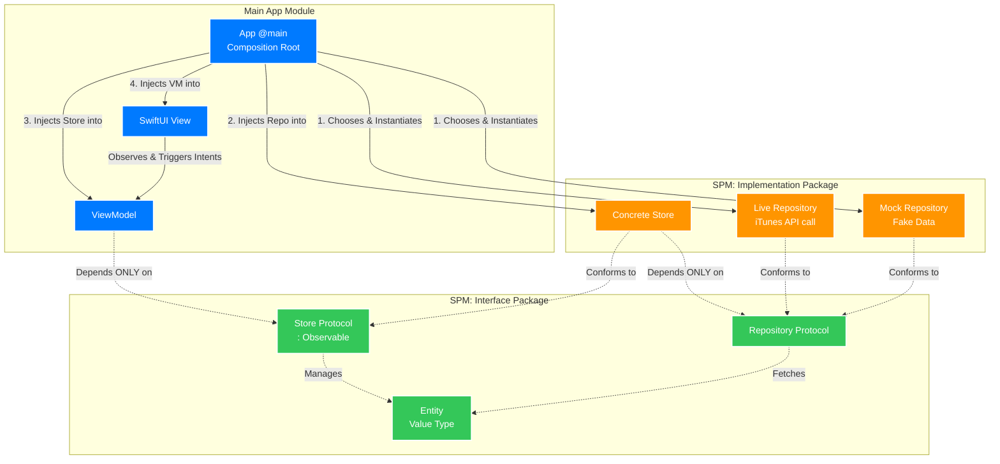

# iOS Modular Architecture — iTunes Search App

A reference summary of the modular architecture pattern for a large-scale iOS app, using an **iTunes Search** app (music, movies, audiobooks) as the concrete example.

The organizing principle is an **interface/implementation split**: every abstraction (protocols and value types) lives in one package, every concrete type (stores and repositories) lives in another, and the **App** is the only place that knows both. A dedicated **Store** layer owns observable state and sits between the ViewModel and the data Repository.

Why iTunes search? The [iTunes Search API](https://itunes.apple.com/search) is **public, free, and requires no API key** — so the *live* repositories in this project are real, working code you can run against `https://itunes.apple.com/search` today. That makes the live-vs-mock swap concrete rather than hypothetical: flip one flag and the same UI runs on real network data or on canned fixtures.

---

## Why modularize?

A monolithic app compiles everything together. As the codebase grows, every small change triggers a full recompile, features bleed into each other, and teams step on each other's work. Modularization addresses this by splitting the app into self-contained Swift packages with explicit, enforced boundaries.

Key benefits:

- **Faster builds** — Xcode only recompiles changed packages
- **Testability** — the real network stack can be swapped for fakes with no network calls
- **Ownership** — each package has a clear responsible team
- **Encapsulation** — implementations are hidden behind the Interface package; nothing leaks by accident
- **Swappability** — the live iTunes client and an in-memory fake are interchangeable, chosen once at startup

---

## Architecture diagram

Dependencies flow strictly **downward**, and every layer depends only on the *protocols* in the layer below it, never on a concrete type. The App module is the single exception — it imports the concrete Implementation package to wire everything together.



Solid arrows = the App instantiating and injecting concrete objects (the "glue"). Dashed arrows = the abstraction barrier: who conforms to / depends on which protocol.

---

## The three groupings

### Main App Module

The `@main` entry point and the composition root. It is the only code in the project that imports the **Implementation** package. It chooses which repository to build (live iTunes or mock), injects the repository into the store, the store into the view model, and the view model into the view. The SwiftUI **Views** and **ViewModels** also live here — but they are written to depend only on the Interface package, so they could be lifted into feature packages later without changing a line (see *Scaling to multiple domains*).

### Interface package — the abstractions

Pure protocols and value types, no behavior, no third-party imports. Contains:

- **Entities** — `Song`, `Movie`, `Audiobook`. Plain `Decodable` value types that mirror the iTunes response.
- **Store protocols** — e.g. `MusicStore`, the observable state abstraction the ViewModel talks to.
- **Repository protocols** — e.g. `MusicRepository`, the data-access abstraction the Store talks to.

Nothing here knows how data is fetched or how state is stored. This package has zero dependencies on Implementation.

### Implementation package — the concretions

Every concrete type, instantiated only by the App:

- **Concrete stores** — `MusicStoreImpl`, an `@Observable` class that conforms to the `MusicStore` protocol and holds a `MusicRepository`.
- **Live repositories** — `LiveMusicRepository`, conforms to `MusicRepository`, calls the real iTunes Search API.
- **Mock repositories** — `MockMusicRepository`, conforms to `MusicRepository`, returns fixture data with no network.

This package imports the **Interface** package (to conform to its protocols) and the core **iTunesAPI** module (for the shared HTTP client). Nothing imports *it* except the App.

> **Core modules** sit beneath the Implementation package as shared infrastructure with no knowledge of any single media domain. The key one here is **`iTunesAPI`**, which wraps `URLSession` and exposes `search`/`lookup` against `https://itunes.apple.com`. Because the iTunes Search API takes **no API key**, this client carries no credentials — its only real concerns are URL-encoding the `term`, decoding the `{ resultCount, results }` envelope, and respecting the API's ~20-requests-per-minute soft limit. `DesignSystem` and `Analytics` are other typical core modules; they are omitted from the diagram for focus.

---

## Module map — iTunes Search app

| Generic concept | iTunes type | Package |
|---|---|---|
| App / Composition Root | `AppContainer`, `iTunesSearchApp`, `AppRootView` | Main App |
| SwiftUI View | `MusicView`, `MovieView`, `AudiobookView`, `CombinedSearchView` | Main App |
| ViewModel | `MusicViewModel`, `MovieViewModel`, `AudiobookViewModel`, `CombinedSearchViewModel` | Main App |
| Entity (value type) | `Song`, `Movie`, `Audiobook` | Interface |
| Store Protocol (`: Observable`) | `MusicStore`, `MovieStore`, `AudiobookStore`, `CombinedSearchStore` | Interface |
| Repository Protocol | `MusicRepository`, `MovieRepository`, `AudiobookRepository` | Interface |
| Concrete Store | `MusicStoreImpl`, `MovieStoreImpl`, `AudiobookStoreImpl`, `CombinedSearchStoreImpl` | Implementation |
| Live Repository | `LiveMusicRepository`, `LiveMovieRepository`, `LiveAudiobookRepository` | Implementation |
| Mock Repository | `MockMusicRepository`, `MockMovieRepository`, `MockAudiobookRepository` | Implementation |
| `iTunesClient` | shared HTTP client (no auth) | iTunesAPI (core) |

---

## The Music slice in detail

The Music feature touches every grouping and illustrates the whole pattern. The dependency chain reads:

```
MusicView ──▶ MusicViewModel ──▶ MusicStore (protocol)
                                      ▲ conforms to
                                 MusicStoreImpl ──▶ MusicRepository (protocol)
                                                        ▲ conforms to
                                       LiveMusicRepository  /  MockMusicRepository
```

`Song` is the value type that flows through all of it — the store manages it, the repository fetches it.

### Interface package — entities

All three media types are their own value type, because the iTunes response shape differs per `media`/`entity`. Each decodes directly from the API with `CodingKeys`. (Each gets a public memberwise `init` too, so mocks, previews, and tests can build values.)

```swift
import Foundation

// MARK: - Song  (media=music, entity=song)
public struct Song: Identifiable, Sendable, Hashable, Decodable {
    public let id: Int                 // trackId
    public let title: String           // trackName
    public let artist: String          // artistName
    public let album: String?          // collectionName
    public let artworkURL: URL?        // artworkUrl100
    public let previewURL: URL?        // previewUrl  (30s AAC clip)
    public let genre: String?          // primaryGenreName
    public let durationMillis: Int?    // trackTimeMillis
    public let price: Double?          // trackPrice
    public let releaseDate: Date?      // releaseDate (ISO-8601)

    private enum CodingKeys: String, CodingKey {
        case id = "trackId", title = "trackName", artist = "artistName"
        case album = "collectionName", artworkURL = "artworkUrl100"
        case previewURL = "previewUrl", genre = "primaryGenreName"
        case durationMillis = "trackTimeMillis", price = "trackPrice", releaseDate
    }

    public init(id: Int, title: String, artist: String, album: String? = nil,
                artworkURL: URL? = nil, previewURL: URL? = nil, genre: String? = nil,
                durationMillis: Int? = nil, price: Double? = nil, releaseDate: Date? = nil) {
        self.id = id; self.title = title; self.artist = artist; self.album = album
        self.artworkURL = artworkURL; self.previewURL = previewURL; self.genre = genre
        self.durationMillis = durationMillis; self.price = price; self.releaseDate = releaseDate
    }
}

// MARK: - Movie  (media=movie, entity=movie)
public struct Movie: Identifiable, Sendable, Hashable, Decodable {
    public let id: Int                 // trackId
    public let title: String           // trackName
    public let director: String        // artistName
    public let artworkURL: URL?        // artworkUrl100
    public let trailerURL: URL?        // previewUrl
    public let genre: String?          // primaryGenreName
    public let contentRating: String?  // contentAdvisoryRating (e.g. "PG-13")
    public let overview: String?       // longDescription
    public let price: Double?          // trackPrice
    public let releaseDate: Date?      // releaseDate

    private enum CodingKeys: String, CodingKey {
        case id = "trackId", title = "trackName", director = "artistName"
        case artworkURL = "artworkUrl100", trailerURL = "previewUrl"
        case genre = "primaryGenreName", contentRating = "contentAdvisoryRating"
        case overview = "longDescription", price = "trackPrice", releaseDate
    }

    public init(id: Int, title: String, director: String, artworkURL: URL? = nil,
                trailerURL: URL? = nil, genre: String? = nil, contentRating: String? = nil,
                overview: String? = nil, price: Double? = nil, releaseDate: Date? = nil) {
        self.id = id; self.title = title; self.director = director; self.artworkURL = artworkURL
        self.trailerURL = trailerURL; self.genre = genre; self.contentRating = contentRating
        self.overview = overview; self.price = price; self.releaseDate = releaseDate
    }
}

// MARK: - Audiobook  (media=audiobook, entity=audiobook)
// Audiobooks are collection-level — there is no trackId/trackName, only collection fields.
public struct Audiobook: Identifiable, Sendable, Hashable, Decodable {
    public let id: Int                 // collectionId
    public let title: String           // collectionName
    public let author: String          // artistName
    public let artworkURL: URL?        // artworkUrl100
    public let genre: String?          // primaryGenreName
    public let summary: String?        // description
    public let price: Double?          // collectionPrice
    public let releaseDate: Date?      // releaseDate

    private enum CodingKeys: String, CodingKey {
        case id = "collectionId", title = "collectionName", author = "artistName"
        case artworkURL = "artworkUrl100", genre = "primaryGenreName"
        case summary = "description", price = "collectionPrice", releaseDate
    }

    public init(id: Int, title: String, author: String, artworkURL: URL? = nil,
                genre: String? = nil, summary: String? = nil, price: Double? = nil,
                releaseDate: Date? = nil) {
        self.id = id; self.title = title; self.author = author; self.artworkURL = artworkURL
        self.genre = genre; self.summary = summary; self.price = price; self.releaseDate = releaseDate
    }
}
```

> **Tip:** iTunes returns 100×100 artwork in `artworkUrl100`. For retina cells, replace the `100x100` substring in the URL with `600x600` (or larger) at display time.

### Interface package — protocols

```swift
// MARK: - Repository protocol (data-access abstraction)
public protocol MusicRepository: Sendable {
    func search(term: String) async throws -> [Song]
    func lookup(id: Int) async throws -> Song?
}

// MARK: - Store protocol (observable-state abstraction)
// Refines `Observable` so SwiftUI can track changes through the protocol type;
// the conforming class carries the @Observable macro.
@MainActor
public protocol MusicStore: AnyObject, Observable {
    var results: [Song] { get }
    var isLoading: Bool { get }
    var errorMessage: String? { get }   // nil unless the last load failed
    func search(term: String) async
}
```

The store models three things, not two: the canonical `results`, whether a load is in flight (`isLoading`), and whether the last load *failed* (`errorMessage`). Without the third, a network error is indistinguishable from "no matches" — the list just goes empty. (A `LoadState` enum — `idle/loading/loaded/failed` — is a tidier alternative once a screen needs to render those states distinctly; `isLoading` + `errorMessage` is the lighter-weight version shown here.)

`MovieRepository`/`MovieStore` and `AudiobookRepository`/`AudiobookStore` have the identical shape — `search(term:)` + `lookup(id:)` on the repository, `results`/`isLoading`/`errorMessage`/`search(term:)` on the store — substituting `Movie` or `Audiobook` for `Song`.

### Implementation package

```swift
import Interface
import iTunesAPI   // only the live repository needs the HTTP client

// MARK: - Concrete Store — owns the canonical, observable state for the domain.
//         Depends only on the MusicRepository *protocol*; never sees a concrete repo.
@Observable
@MainActor
public final class MusicStoreImpl: MusicStore {
    public private(set) var results: [Song] = []
    public private(set) var isLoading = false
    public private(set) var errorMessage: String? = nil

    private let repository: any MusicRepository
    private var searchTask: Task<Void, Never>?

    public init(repository: any MusicRepository) {
        self.repository = repository
    }

    public func search(term: String) async {
        // A new search supersedes the previous one. Cancelling the in-flight
        // task is what prevents a slow earlier response from landing *after*
        // a faster later one and clobbering the newer results.
        searchTask?.cancel()

        let trimmed = term.trimmingCharacters(in: .whitespaces)
        guard !trimmed.isEmpty else {
            results = []; errorMessage = nil; isLoading = false; return
        }

        isLoading = true
        errorMessage = nil
        let task = Task {
            do {
                let songs = try await repository.search(term: trimmed)
                guard !Task.isCancelled else { return }   // superseded — let the newer search own state
                results = songs
            } catch {
                guard !Task.isCancelled else { return }
                results = []
                errorMessage = error.localizedDescription
            }
            isLoading = false   // only the live (non-cancelled) task clears the spinner
        }
        searchTask = task
        await task.value
    }
}

// MARK: - Live Repository — real iTunes Search API. No API key required.
public struct LiveMusicRepository: MusicRepository {
    private let client: iTunesClient

    public init(client: iTunesClient) {
        self.client = client
    }

    public func search(term: String) async throws -> [Song] {
        // Cap the page explicitly rather than relying on the client default;
        // a smaller `limit` is the cheapest defence against the rate limit.
        try await client.search(term: term, media: "music", entity: "song", limit: 25)
    }

    public func lookup(id: Int) async throws -> Song? {
        try await client.lookup(id: id)
    }
}

// MARK: - Mock Repository — first-class, no network. Used for previews,
//         UI tests, offline demo mode, and unit tests.
public struct MockMusicRepository: MusicRepository {
    public var stubbed: [Song]

    public init(stubbed: [Song] = MockMusicRepository.sample) {
        self.stubbed = stubbed
    }

    public func search(term: String) async throws -> [Song] {
        guard !term.isEmpty else { return stubbed }
        return stubbed.filter {
            $0.title.localizedCaseInsensitiveContains(term) ||
            $0.artist.localizedCaseInsensitiveContains(term)
        }
    }

    public func lookup(id: Int) async throws -> Song? {
        stubbed.first { $0.id == id }
    }

    public static let sample: [Song] = [
        Song(id: 1, title: "Come Together", artist: "The Beatles", album: "Abbey Road"),
        Song(id: 2, title: "Here Comes the Sun", artist: "The Beatles", album: "Abbey Road")
    ]
}
```

The core HTTP client lives in `iTunesAPI` and is generic over the decoded item, so every live repository reuses it:

```swift
// iTunesAPI/Sources/iTunesAPI/iTunesClient.swift
import Foundation

public struct iTunesClient: Sendable {
    private let session: URLSession
    private let baseURL = URL(string: "https://itunes.apple.com")!

    public init(session: URLSession = .shared) { self.session = session }

    private struct Envelope<Item: Decodable>: Decodable {
        let resultCount: Int
        let results: [Item]
    }

    public func search<Item: Decodable & Sendable>(
        term: String, media: String, entity: String, limit: Int = 25
    ) async throws -> [Item] {
        var components = URLComponents(
            url: baseURL.appendingPathComponent("search"),
            resolvingAgainstBaseURL: false
        )!
        // URLQueryItem handles percent-encoding of the search term for us.
        components.queryItems = [
            .init(name: "term",   value: term),
            .init(name: "media",  value: media),
            .init(name: "entity", value: entity),
            .init(name: "limit",  value: String(limit))
        ]
        let (data, _) = try await session.data(from: components.url!)
        return try decoder.decode(Envelope<Item>.self, from: data).results
    }

    public func lookup<Item: Decodable & Sendable>(id: Int) async throws -> Item? {
        var components = URLComponents(
            url: baseURL.appendingPathComponent("lookup"),
            resolvingAgainstBaseURL: false
        )!
        components.queryItems = [.init(name: "id", value: String(id))]
        let (data, _) = try await session.data(from: components.url!)
        return try decoder.decode(Envelope<Item>.self, from: data).results.first
    }

    private var decoder: JSONDecoder {
        let d = JSONDecoder()
        // iTunes dates are ISO-8601, but the fractional-seconds suffix is
        // inconsistent across endpoints. A bare `.iso8601` strategy throws on
        // whichever variant it isn't expecting, so accept both.
        d.dateDecodingStrategy = .custom { decoder in
            let raw = try decoder.singleValueContainer().decode(String.self)
            let f = ISO8601DateFormatter()
            f.formatOptions = [.withInternetDateTime, .withFractionalSeconds]
            if let date = f.date(from: raw) { return date }
            f.formatOptions = [.withInternetDateTime]
            if let date = f.date(from: raw) { return date }
            throw DecodingError.dataCorrupted(.init(
                codingPath: decoder.codingPath,
                debugDescription: "Unrecognized iTunes date: \(raw)"))
        }
        return d
    }
}
```

### Key relationship: the abstraction barrier

The barrier has two rungs:

- `MusicViewModel` depends on `MusicStore` — the **protocol** — not on `MusicStoreImpl`, and it never mentions a repository at all. Data access is the store's concern.
- `MusicStoreImpl` depends on `MusicRepository` — the **protocol** — not on `LiveMusicRepository` or `MockMusicRepository`.

Neither the view model nor the store can import `iTunesAPI`, and neither knows whether songs come from the network or from fixtures. The single decision of *which* repository to use is made once, in the App.

---

## The App module — composition root

The App module is the only place that imports the **Implementation** package, and therefore the only place where `Live*` / `Mock*` / `*Impl` types are named. It performs the four wiring steps from the diagram.

### AppContainer.swift

```swift
import Foundation
import SwiftUI

import Interface        // protocols + entities
import Implementation   // concrete stores + live/mock repositories
import iTunesAPI        // core HTTP client

@MainActor
@Observable
final class AppContainer {

    let musicViewModel:     MusicViewModel
    let movieViewModel:     MovieViewModel
    let audiobookViewModel: AudiobookViewModel
    let searchViewModel:    CombinedSearchViewModel   // spans all three domains

    init(useMockData: Bool = AppConfig.useMockData) {

        // Core — one shared iTunes client. No API key: the Search API is public.
        let client = iTunesClient(session: .shared)

        // STEP 1 — choose live (real iTunes API) or mock (fixtures) repositories.
        // This is the ONE decision the rest of the app never sees.
        let musicRepo: any MusicRepository =
            useMockData ? MockMusicRepository() : LiveMusicRepository(client: client)
        let movieRepo: any MovieRepository =
            useMockData ? MockMovieRepository() : LiveMovieRepository(client: client)
        let audiobookRepo: any AudiobookRepository =
            useMockData ? MockAudiobookRepository() : LiveAudiobookRepository(client: client)

        // STEP 2 — inject each repository into its concrete store.
        let musicStore     = MusicStoreImpl(repository: musicRepo)
        let movieStore     = MovieStoreImpl(repository: movieRepo)
        let audiobookStore = AudiobookStoreImpl(repository: audiobookRepo)

        // STEP 3 — inject each store (as a protocol) into its view model.
        musicViewModel     = MusicViewModel(store: musicStore)
        movieViewModel     = MovieViewModel(store: movieStore)
        audiobookViewModel = AudiobookViewModel(store: audiobookStore)

        // Combined search spans three domains — the App is the right place to compose them.
        let searchStore = CombinedSearchStoreImpl(
            musicRepository:     musicRepo,
            movieRepository:     movieRepo,
            audiobookRepository: audiobookRepo
        )
        searchViewModel = CombinedSearchViewModel(store: searchStore)

        // STEP 4 happens in the View tree (see iTunesSearchApp).
    }
}

// Live vs Mock is a launch-time / build-config decision.
enum AppConfig {
    static var useMockData: Bool {
        #if DEBUG
        ProcessInfo.processInfo.arguments.contains("-useMockData")
        #else
        false
        #endif
    }
}
```

### iTunesSearchApp.swift

```swift
import SwiftUI

@main
struct iTunesSearchApp: App {
    @State private var container = AppContainer()

    var body: some Scene {
        WindowGroup {
            AppRootView()
                // STEP 4 — inject each view model into the environment.
                .environment(container.searchViewModel)
                .environment(container.musicViewModel)
                .environment(container.movieViewModel)
                .environment(container.audiobookViewModel)
        }
    }
}
```

### AppRootView.swift

```swift
import SwiftUI

struct AppRootView: View {
    var body: some View {
        TabView {
            NavigationStack { CombinedSearchView() }
                .tabItem { Label("Search",     systemImage: "magnifyingglass") }
            NavigationStack { MusicView() }
                .tabItem { Label("Music",      systemImage: "music.note")      }
            NavigationStack { MovieView() }
                .tabItem { Label("Movies",     systemImage: "film")            }
            NavigationStack { AudiobookView() }
                .tabItem { Label("Audiobooks", systemImage: "headphones")      }
        }
    }
}
```

### View and ViewModel

The view reads its view model from the environment and triggers intents. The view model depends only on the Store protocol.

```swift
// MusicViewModel.swift — imports ONLY Interface
import Interface

@MainActor
@Observable
final class MusicViewModel {
    private let store: any MusicStore

    // The view model owns the *input*; the store owns the *results*.
    var searchTerm = "" {
        didSet { scheduleSearch() }
    }

    private var debounceTask: Task<Void, Never>?

    init(store: any MusicStore) {
        self.store = store
    }

    // Screen-facing state, read straight from the store.
    var songs: [Song] { store.results }       // canonical list lives in the store
    var isLoading: Bool { store.isLoading }
    var errorMessage: String? { store.errorMessage }

    // Debouncing is a *presentation* concern (it's about typing cadence, not
    // data), so it belongs here, not in the store. This keeps the store a
    // pure state container and gives even a "thin" view model a real job.
    private func scheduleSearch() {
        debounceTask?.cancel()
        debounceTask = Task {
            try? await Task.sleep(for: .milliseconds(300))
            guard !Task.isCancelled else { return }
            await store.search(term: searchTerm)
        }
    }

    // Submit (Return key) searches immediately, skipping the debounce.
    func search() async {
        debounceTask?.cancel()
        await store.search(term: searchTerm)
    }
}
```

```swift
// MusicView.swift
import SwiftUI
import Interface   // for the Song type it displays

struct MusicView: View {
    @Environment(MusicViewModel.self) private var viewModel

    var body: some View {
        @Bindable var viewModel = viewModel   // needed to bind a property of an @Observable
        List(viewModel.songs) { song in
            SongRowView(song: song)
        }
        .overlay {
            if viewModel.isLoading {
                ProgressView()
            } else if let message = viewModel.errorMessage {
                ContentUnavailableView(
                    "Couldn’t load results",
                    systemImage: "wifi.slash",
                    description: Text(message)
                )
            }
        }
        .searchable(text: $viewModel.searchTerm)   // each keystroke flows through the debounce
        .onSubmit(of: .search) { Task { await viewModel.search() } }
        .navigationTitle("Music")
    }
}
```

The View has no reference to `AppContainer`, `MusicStoreImpl`, or any repository.

### Why every View gets a ViewModel — even thin ones

`MusicViewModel` is deliberately slim: most of its surface forwards to the store. The convention is still **one ViewModel per View, always**, and it pays off for three reasons.

It gives every screen one predictable shape and a single injection point, so wiring and tests look the same everywhere instead of "store-backed here, view-model-backed there." It gives screen-specific concerns a home from day one — the debounce above lives in the view model, and selection state, field validation, or display formatting would join it later **without** retrofitting a view model and rewiring the view. And it keeps the split between *shared* and *per-screen* state honest: the store is the canonical, possibly-shared source of truth, while each view model is free to layer its own screen state on top. Two screens can present the same store through different view models without fighting over it.

The store stays a pure state container; the view model is where presentation logic accretes. Starting thin is fine — the point is that the seam already exists when you need it.

---

## Combined search — the multi-domain case

A single search bar that queries music, movies, and audiobooks at once is the natural analog of a cross-domain feature. `CombinedSearchStoreImpl` composes all three repositories and fans the request out concurrently.

It deliberately composes the three **typed** repositories rather than hitting the API once with `media=all`. The payoff is type safety: the store exposes `[Song]`, `[Movie]`, and `[Audiobook]` as separate, strongly-typed groups instead of one heterogeneous, stringly-typed blob.

```swift
// Interface package
@MainActor
public protocol CombinedSearchStore: AnyObject, Observable {
    var songs: [Song] { get }
    var movies: [Movie] { get }
    var audiobooks: [Audiobook] { get }
    var isLoading: Bool { get }
    var errorMessage: String? { get }
    func search(term: String) async
}
```

```swift
// Implementation package
import Interface

@Observable
@MainActor
public final class CombinedSearchStoreImpl: CombinedSearchStore {
    public private(set) var songs: [Song] = []
    public private(set) var movies: [Movie] = []
    public private(set) var audiobooks: [Audiobook] = []
    public private(set) var isLoading = false
    public private(set) var errorMessage: String? = nil

    private let musicRepository:     any MusicRepository
    private let movieRepository:     any MovieRepository
    private let audiobookRepository: any AudiobookRepository

    public init(musicRepository: any MusicRepository,
                movieRepository: any MovieRepository,
                audiobookRepository: any AudiobookRepository) {
        self.musicRepository = musicRepository
        self.movieRepository = movieRepository
        self.audiobookRepository = audiobookRepository
    }

    public func search(term: String) async {
        let trimmed = term.trimmingCharacters(in: .whitespaces)
        guard !trimmed.isEmpty else {
            songs = []; movies = []; audiobooks = []
            errorMessage = nil; isLoading = false; return
        }

        isLoading = true
        errorMessage = nil
        defer { isLoading = false }

        // Fan out concurrently — three independent iTunes calls.
        // `try?` per call keeps partial results: one domain failing shouldn't
        // wipe out the other two.
        async let songs      = try? musicRepository.search(term: trimmed)
        async let movies     = try? movieRepository.search(term: trimmed)
        async let audiobooks = try? audiobookRepository.search(term: trimmed)

        let s = await songs, m = await movies, a = await audiobooks
        self.songs = s ?? []; self.movies = m ?? []; self.audiobooks = a ?? []

        // Surface an error only when *every* domain failed — a partial result
        // is still useful and shouldn't read as a total failure. (If you need
        // the specific underlying error, swap each `try?` for a `Task` and
        // inspect its `.result`.)
        if s == nil, m == nil, a == nil {
            errorMessage = "Search failed. Check your connection and try again."
        }
    }
}
```

This cross-domain composition lives in `AppContainer`, never inside any single media package — which is the whole point of the next section's rule about multi-domain knowledge.

---

## Testing

Because the Repository and the Store are both behind protocols, and the **mock repositories are shipping parts of the Implementation package**, testing requires no network and no simulator. You can test at two levels.

### Testing the Store — inject a repository

```swift
final class MusicStoreTests: XCTestCase {
    @MainActor
    func testSearchPopulatesResults() async {
        let store = MusicStoreImpl(repository: MockMusicRepository())

        await store.search(term: "Beatles")

        XCTAssertFalse(store.results.isEmpty)
        XCTAssertFalse(store.isLoading)
    }

    @MainActor
    func testEmptyTermClearsResults() async {
        let store = MusicStoreImpl(repository: MockMusicRepository())
        await store.search(term: "   ")
        XCTAssertTrue(store.results.isEmpty)
    }

    @MainActor
    func testFailureSurfacesErrorMessage() async {
        struct FailingRepository: MusicRepository {
            struct Boom: Error {}
            func search(term: String) async throws -> [Song] { throw Boom() }
            func lookup(id: Int) async throws -> Song? { nil }
        }
        let store = MusicStoreImpl(repository: FailingRepository())

        await store.search(term: "anything")

        XCTAssertTrue(store.results.isEmpty)
        XCTAssertNotNil(store.errorMessage)   // failure is visible, not silent
        XCTAssertFalse(store.isLoading)
    }
}
```

### Testing the ViewModel — inject a stub store

The view model only knows the `MusicStore` protocol, so a tiny in-test stub is enough. Note the `@Observable` macro: because `MusicStore` refines `Observable`, every conformer — stubs included — has to satisfy that conformance, and the macro is what synthesizes it. A plain class here would not compile.

```swift
@MainActor
@Observable
final class StubMusicStore: MusicStore {
    var results: [Song] = []
    var isLoading = false
    var errorMessage: String? = nil
    private(set) var searchedTerms: [String] = []
    func search(term: String) async { searchedTerms.append(term) }
}

final class MusicViewModelTests: XCTestCase {
    @MainActor
    func testSearchForwardsTermToStore() async {
        let store = StubMusicStore()
        let viewModel = MusicViewModel(store: store)
        viewModel.searchTerm = "Daft Punk"

        await viewModel.search()

        XCTAssertEqual(store.searchedTerms, ["Daft Punk"])
    }
}
```

`Movie`/`Audiobook` and their stores and view models test the same way — swap the repository or the store, no other changes needed.

---

## Scaling to multiple domains

The diagram shows a single Interface package and a single Implementation package, and this README keeps all three media domains inside them. That is the right starting point and works well when one team owns the data layer.

As the app and the org grow, split **per domain**: `MusicInterface` + `MusicImplementation`, `MoviesInterface` + `MoviesImplementation`, and so on. The pattern is identical at any granularity — abstractions in the interface package, concretions in the implementation package, the App as the sole composition root. You can also lift each feature's `View` + `ViewModel` out of the App and into a feature package that imports only that domain's interface package; nothing about those types changes, because they already depend on protocols alone.

---

## Practical rules

**Only the App imports the Implementation package.**
The strongest enforcement is the package graph itself: if feature targets simply don't *declare* a dependency on the Implementation package, then `import Implementation` outside the App is a compile error, not a convention someone has to remember. Treat `grep -rl "import Implementation" --include="*.swift"` (which should match only the composition root) as a CI backstop, not the primary guard — a grep can be skipped, the dependency graph can't.

**The ViewModel depends on the Store protocol, never on a Repository.**
Data access is the store's job. If a view model imports or references a repository (or `iTunesClient`), the layering has collapsed.

**The Store depends on the Repository protocol, never on a concrete repository.**
The store is repository-agnostic; the same `MusicStoreImpl` works with the live or the mock repo. The choice is made once, in the App.

**Entities are value types and live in the Interface package.**
Both stores and repositories traffic in the same `Song`, `Movie`, `Audiobook`. Models never live in the Implementation package.

**Concrete types live in the Implementation package and are instantiated only in the composition root.**
`MusicStoreImpl`, `LiveMusicRepository`, and `MockMusicRepository` are each created exactly once, inside `AppContainer`.

**Choosing Live vs Mock is a composition-root decision.**
Driven by build configuration or launch arguments. The view models, stores, and views are byte-for-byte identical in either mode — that is the whole point of the split. Pass `-useMockData` to run the entire app offline on fixtures.

**Cross-domain wiring belongs in the App.**
`CombinedSearchStoreImpl` needs all three repositories. That cross-domain composition lives in `AppContainer`, not inside any single media package.

---

## Common pitfalls

| Pitfall | Consequence | Fix |
|---|---|---|
| Importing `Implementation` outside the App | Concrete type leaks past the barrier; testing and swapping break | Don't declare the dependency on feature targets — the compiler then rejects the import; keep a grep/lint check in CI as a backstop |
| Letting a stale search response overwrite a newer one | Results flicker or land out of order while typing | Hold the in-flight `Task` and cancel it on each new search (see `MusicStoreImpl`) |
| ViewModel reaching past the Store to a Repository | The Store layer is bypassed; state has two sources of truth | The view model talks to `MusicStore` and nothing else |
| Holding canonical state in the ViewModel | Duplicated, drifting state across screens | The Store owns domain state; the view model derives screen-specific state from it |
| Decoding `media=all` into one entity | A heterogeneous blob loses type safety and per-media fields | Use a typed repository per `media`/`entity`; compose them in `CombinedSearchStoreImpl` |
| Ignoring the rate limit | The Search API throttles (~20 req/min); rapid typing floods it | Debounce in the view model (see `MusicViewModel`) and cap `limit` in the repository; cache results keyed by the full query |
| Putting decode/`CodingKeys` logic in the live repository | The same mapping gets duplicated per repository | Decode straight into the entity (shared `iTunesClient` envelope), or split DTO↔entity once |
| Mocking the Repository *and* the Store for the same test | Redundant fakes, brittle tests | Test the store with a mock repository; test the view model with a stub store |