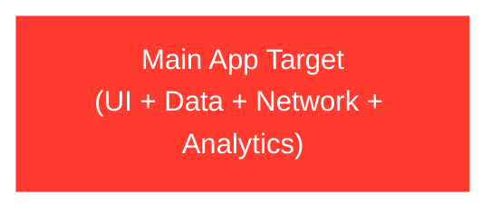
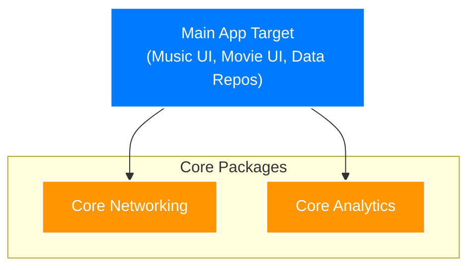
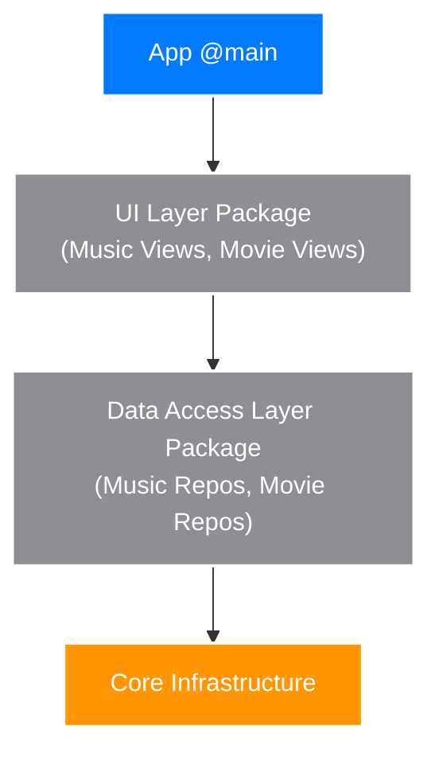
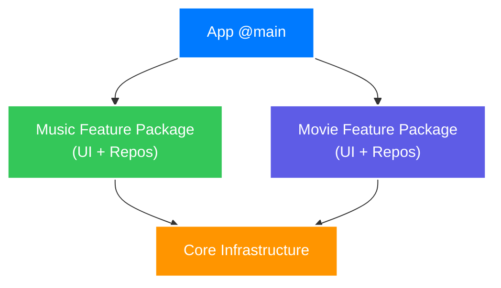
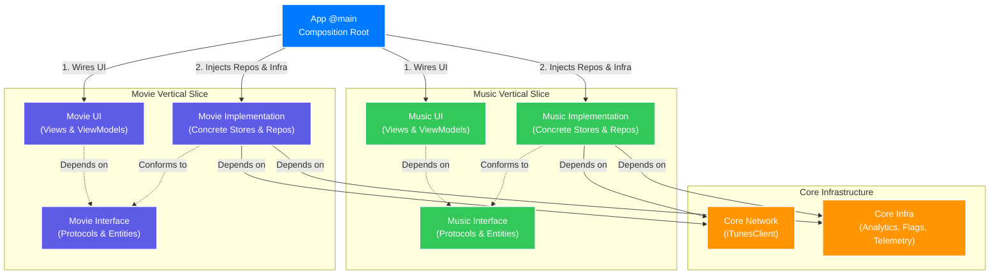

# The Evolutionary Path to Modularization

Architecture is best understood as a response to friction. This document represents the *final destination*, but teams should arrive here incrementally.

### Stage 1: The Monolithic App

The default starting point. UI, data, and network logic live in a single target.

* **The Breaking Point:** Merge conflicts multiply as the team grows past 3 developers. Every UI tweak triggers a massive recompilation.
* **Indicators it's time to move:**
    * **Build Times:** Incremental builds take longer than 1-2 minutes.
    * **Merge Conflicts:** Constant collisions in `App.xcodeproj` or shared `AppDelegate` / `App` struct.
    * **Testing Friction:** Unable to run UI tests in isolation without launching the entire app.
    * **Feature Entanglement:** A bug in the Movies feature inadvertently breaks the Music feature because of shared state or massive God objects.

### Stage 2: Core Extraction (Bottom-Up Modularization)

Extracting domain-agnostic foundations (Networking, Analytics) into isolated packages.

* **The Breaking Point:** While third-party SDKs are hidden, feature teams are still colliding in the main app target.

### Stage 3: The Horizontal Trap (Layer-Driven Modularization)

The instinctual move to modularize by technical function. Teams group all repositories and models into a massive `DataAccessLayer` package, and all views into a shared `UILayer`.

While it feels like progress, this creates a cautionary tale of distributed coupling. If the Music team needs to add a new song endpoint, they must modify the shared `DataAccessLayer`. This forces a rebuild of the entire data layer for everyone, risking merge conflicts with the Movies team who might be working in the exact same package. A single feature is now fragmented across multiple disconnected codebase layers.

* **The Breaking Point:** High blast radius for domain-specific changes. Feature teams constantly step on each other's toes in shared horizontal modules. "Simple" feature updates require touching 3-4 different packages. Cross-domain data sharing within the massive data layer frequently causes circular dependencies.

### Stage 4: Vertical Slices (Package by Feature)

The pivot to slicing the app by business domain. The horizontal layers are torn down, and instead, code is grouped by feature: a `MusicFeature` package and a `MovieFeature` package. Each vertical slice is completely autonomous, containing its own UI, Models, and Data Access logic tailored specifically for that domain.

* **The Breaking Point:** While team autonomy is solved, testing remains painful. Because views within the vertical slice instantiate their concrete network repositories directly, simulating offline states, swapping mocks for SwiftUI previews, or writing unit tests requires heavy refactoring and overriding. The domain is isolated, but its internal layers are tightly coupled.

### Stage 5: The Abstraction Barrier (The Final Matrix)

Splitting the vertical slices into Interface and Implementation to achieve total decoupling, swappability, and testability. The `MainApp` becomes the single composition root that wires the matrix together.

